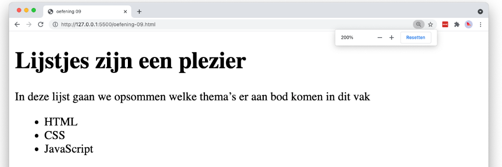

# 💻 02. HTML - basis > oefening 01

## 🛠️ opdrachten

### `index.html` maken

- [ ] Maak een nieuw bestand genaamd `index.html` aan in deze map.
- [ ] Open het bestand.

### voorbeeld namaken

- [ ] Maak het volgende voorbeeld na met behulp van HTML. Gebruik hiervoor de elementen `title`, `h1`, `p`, `ul` en `li`.

## 💡 vragen

- Waarvoor staat de afkorting `ul`?
- Waarvoor staat de afkorting `li`?
- Welke elementen worden in deze oefening "genest"?
