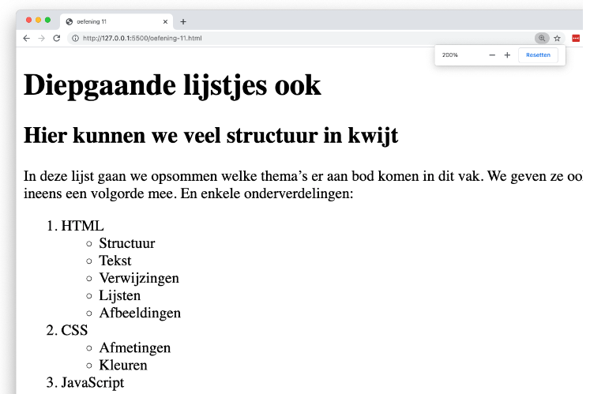

# 💻 LES: W1 - HTML basis - Oefening 03

## 🛠️ Opdrachten

### `index.html` maken

 - [ ] Maak een nieuw bestand genaamd `index.html` aan in deze map.
 - [ ] Open het bestand.

### Voorbeeld Namaken

- [ ] Maak het volgende voorbeeld na met behulp van HTML. Gebruik hiervoor de elementen `title`, `h1`, `p`, `ol`, `ul` en `li`.

## 💡 Vragen

 - Welke elementen worden in deze oefening "genest"?
 - Hoeveel "nesting niveau's" heb je hier?