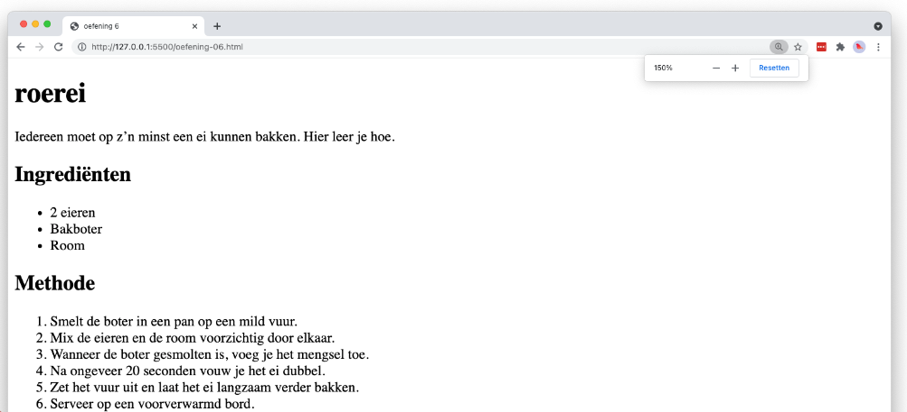

# 💻 02. HTML - basis > oefening 05

## 🛠️ opdrachten

### `index.html` maken

- [ ] Maak een nieuw bestand genaamd `index.html` aan in deze map.
- [ ] Open het bestand.

### voorbeeld namaken

- [ ] Maak het volgende voorbeeld na met behulp van HTML. Bedenk zelf welke elementen het meest geschikt zijn voor elk onderdeel.

