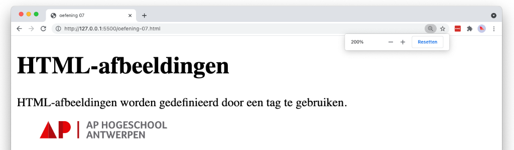

# 💻 LES: W1 - HTML basis - Oefening 06

## 🛠️ Opdrachten

### `index.html` maken

 - [ ] Maak een nieuw bestand genaamd `index.html` aan in deze map.
 - [ ] Open het bestand.

### Voorbeeld Namaken

- [ ] Maak het volgende voorbeeld na met behulp van HTML. Gebruik hiervoor de elementen `title`, `h1`, `p` en `img`.
  - De afbeelding vind je terug op de url: https://www.ap.be/themes/custom/ap_hogeschool/src/images/logo-ap.svg
  - In het voorbeeld is de afbeelding 230 pixels breed en 23 pixels hoog.

