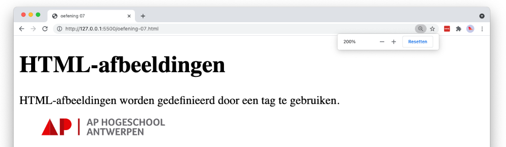

# 💻 LES: W1 - HTML basis - Oefening 07

## 🛠️ Opdrachten

### `index.html` maken

 - [ ] Maak een nieuw bestand genaamd `index.html` aan in deze map.
 - [ ] Open het bestand.

### Voorbeeld Namaken

- [ ] Kopieer de code uit oefening 06.
- [ ] Zorg er nu voor dat de afbeelding een link is waar je op kan klikken. De link moet verwijzen naar de url: https://apwt.gitbook.io/g_webtechnologie/html/html-structuur

