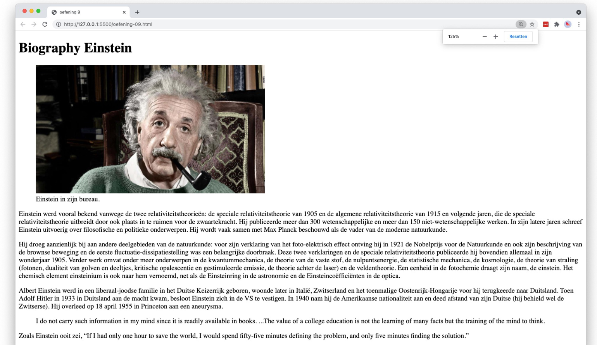

# 💻 02. HTML - basis > oefening 09

## 🛠️ opdrachten

### `index.html` maken

- [ ] Maak een nieuw bestand genaamd `index.html` aan in deze map.
- [ ] Open het bestand.

### voorbeeld namaken

- [ ] Maak het volgende voorbeeld na met behulp van HTML. Bedenk zelf welke elementen het meest geschikt zijn voor elk onderdeel.
      **Denk ook aan de elementen van vorige week!**
- [ ] Gebruik hierbij de afbeelding van Einstein door het plaatsen van volgende link: https://www.biosiglos.com/wp-content/uploads/2007/10/albert-einstein-1.jpg.
- [ ] Gebruik de tekst `bijlage-tekst.txt`.
- [ ] **spoiler alert (!):** Onderaan ergens in de tekst staat een quote die in HTML moet verwerkt worden.
  - **tip:** Gebruik websites als [w3schools](https://www.w3schools.com) of [MDN](https://developer.mozilla.org/en-US/docs/Web/HTML) om weinig bekende elementen op te zoeken. Uiteraard kan Google ook altijd helpen!

