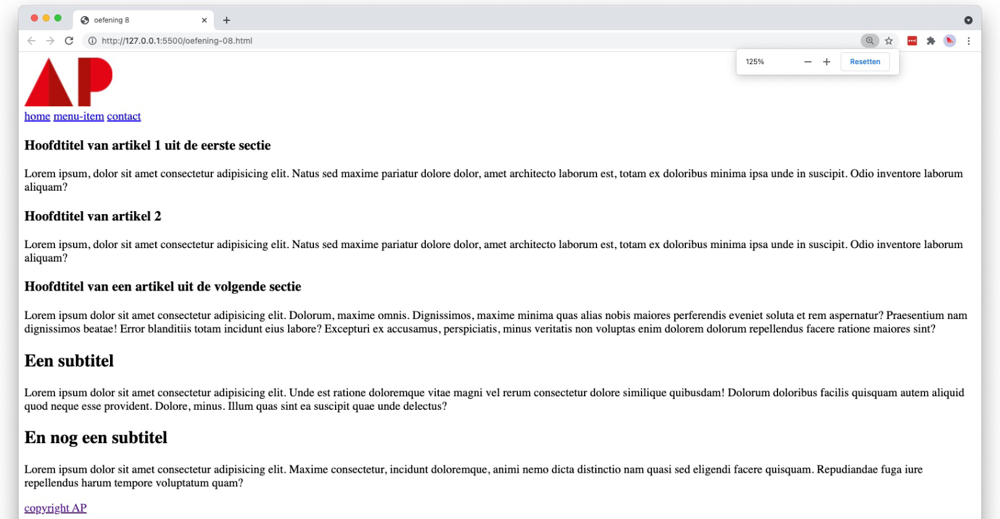

# 💻 02. HTML - basis > oefening 10

## 🛠️ opdrachten

### `index.html` maken

- [ ] Maak een nieuw bestand genaamd `index.html` aan in deze map.
- [ ] Open het bestand.

### voorbeeld namaken

- [ ] Maak het volgende voorbeeld na met behulp van HTML. Bedenk zelf welke elementen het meest geschikt zijn voor elk onderdeel. **Denk ook aan de elementen van vorige week!**
- [ ] Gebruik hierbij het logo `AP-logo.png`.
  - **tip:** Gebruik websites als [w3schools](https://www.w3schools.com) of [MDN](https://developer.mozilla.org/en-US/docs/Web/HTML) om weinig bekende elementen op te zoeken. Uiteraard kan Google ook altijd helpen!
  - **tip:** Als je nog niet weet naar welke url een link zal verwijzen, kan je daar (voorlopig) een `#` gebruiken. Zo wordt de link wel weergegeven als een link, maar doet die op zich niets.

